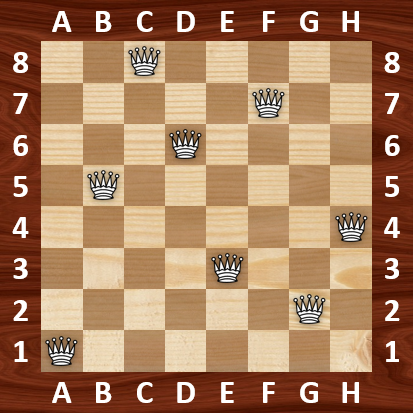

# _N_-Queens Problem  
Author: [James Walker](http://github.com/JDSWalker)  
©2017 under the [MIT license]  

## Overview  
The _N_-queens problem is a generalization of the [8-queens puzzle] involving 
how to place eight non-attacking queens on a regular [chess board]. The 
_N_-queens problem asks, given a positive integer _N_, how many ways are there 
to place _N_ chess queens on an _N_ × _N_ chess board such that none of the 
queens can attack each other.  

The programs in this repository implement an algorithm that performs a 
constrained depth-first search (DFS) of the chess board to find solutions to 
the _N_-queens problem. The programs are outlined below, with further 
descriptions about their execution provided in their respective folders. 
Following this, general results are presented and explained. Lastly, an outline 
of the constrained DFS algorithm is provided along with a source link.  

**C Programs in the** `src_C` **folder**:  
- 8-Queens Solver (`eight_queens_solver.c`)  
- _N_-Queens Solver (`n_queens_solver.c`)  
- _N_-Queens Counter (`n_queens_counter.c`)  

**Python Programs in the** `src_Python` **folder**:  
- _N_-Queens Counter (`n_queens_counter.py`, `n_queens_multicore_counter.py`)  

**R Programs in the** `src_R` **folder**:  
- _N_-Queens Solver (`n_queens_solver.R`)  
- _N_-Queens Counter (`n_queens_counter.R`, `n_queens_counter_optimized.R`)  

Results from the solver program are output as a series of _N_ integers 
corresponding to the columns on the chess board, with each integer represents 
the row of the queen in the given column from A to H. In the example shown 
below, the numbers in the 8-queens solution `1 5 8 6 3 7 2 4` are sequentially 
ordered by column from A to H. Thus, queens are positioned on the chess board 
at `A1`, `B5`, `C8`, `D6`, `E3`, `F7`, `G2`, and `H4`.  

   
  
### Number Solutions for _N_-Queens Problems  
The _N_-Queens Counter programs have been used to find the number of queen 
placements and the number of _N_-queens solutions for values of _N_ between 1 
and 15 with the Python and R implementations, and values of _N_ between 1 and 
19 with the C implementation. As can be seen from the results in the table 
below, the constrained DFS algorithm significantly reduces the search-space of 
the problem compared to the (_N_<sup>2</sup>)!/(_N_<sup>2</sup> − _N_)! 
placements that would be made by most naïve combinatorial algorithm.  

For the _N_-Queens Counter implementations in C and Python, the algorithm was 
improved to take the symmetry of the chess board into account. This 
modification enables the programs to count all of the possible _N_-queens 
solutions using half the number of queen placements required by 
the original algorithm.  

#### Number of Queens Placed using Different _N_-Queens Solver Algorithms  
| _N_ | Naïve Combinitorial | Constrained DFS | Symmetry Constrained DFS | Number of Solutions |  
|:--:|------------------------:|----------------:|----------------:|---------------:|  
|  1 |                       1 |               1 |               1 |              1 |  
|  2 |                      12 |               2 |               1 |              0 |  
|  3 |                     504 |               5 |               3 |              0 |  
|  4 |                  43,680 |              16 |               8 |              2 |  
|  5 |               6,375,600 |              53 |              27 |             10 |  
|  6 |  1.402 × 10<sup>9</sup> |             152 |              76 |              4 |  
|  7 | 4.329 × 10<sup>11</sup> |             551 |             276 |             40 |  
|  8 | 1.785 × 10<sup>14</sup> |           2,056 |           1,028 |             92 |  
|  9 | 9.467 × 10<sup>16</sup> |           8,393 |           4,197 |            352 |  
| 10 | 6.282 × 10<sup>19</sup> |          35,538 |          17,769 |            724 |  
| 11 | 5.096 × 10<sup>22</sup> |         166,925 |          83,463 |          2,680 |  
| 12 | 4.963 × 10<sup>25</sup> |         856,188 |         428,094 |         14,200 |  
| 13 | 5.714 × 10<sup>28</sup> |       4,674,889 |       2,337,445 |         73,712 |  
| 14 | 7.676 × 10<sup>31</sup> |      27,358,552 |      13,679,276 |        365,596 |  
| 15 | 1.190 × 10<sup>35</sup> |     171,129,071 |      85,564,536 |      2,279,184 |  
| 16 | 2.109 × 10<sup>38</sup> |   1,141,190,302 |     570,595,151 |     14,772,512 |  
| 17 | 4.235 × 10<sup>41</sup> |   8,017,021,931 |   4,008,510,966 |     95,815,104 |  
| 18 | 9.570 × 10<sup>44</sup> |  59,365,844,490 |  29,682,922,245 |    666,090,624 |
| 19 | 2.417 × 10<sup>48</sup> | 461,939,618,823 | 230,969,809,412 |  4,968,057,848 |
| 20 | 6.784 × 10<sup>51</sup> |             ??? |             ??? | 39,029,188,884 |

According to the [On-Line Encyclopedia of Integer Sequences] \(OEIS sequence: 
[A000170]), the total number of solutions for the _N_-queens problem has been 
determined for every value of _N_ up to 27.  

### Constrained DFS Algorithm Details  
The algorithm implemented to solve the 8-queens problem was obtained online 
from the bottom of the webpage for 
[A Short Introduction to the Art of Programming] by [Dr. Edsger W. Dijkstra]. 
The 8-queens solver algorithm, shown below, has been adapted and reformatted 
from the one provided in the link above.  

```
begin ALGORITHM  
  integer n  
  integer h  
  integer k  
  integer array x[0:7]  
  boolean array col[0:7]  
  boolean array up[-7:+7]  
  boolean array down[0:14]  
  
  procedure INITIALIZE EMPTY BOARD:  
    n := 0  
    k := 0  
    repeat until k = 8:  
      col[k] := true  
      k := k + 1  
    end repeat  
    k := 0  
    repeat until k = 15:  
      up[k-7] := true  
      down[k] := true  
      k := k + 1  
    end repeat  
  end procedure INITIALIZE EMPTY BOARD

  procedure PLACE NEXT QUEEN:  
    h := 0  
    repeat until h = 8:  
      if SQUARE H FREE (col[h] = true AND up[n-h] = true AND down[n+h] = true):  
        begin SET QUEEN ON SQUARE H:  
          x[n] := h  
          col[h] := false  
          up[n-h] := false  
          down[n+h] := false  
          n := n + 1  
        end SET QUEEN ON SQUARE H  
        if BOARD FULL (n = 8):  
          begin PRINT QUEEN POSITIONS:  
            k := 0  
            repeat until k = 8:  
              print(x[k])  
              k := k + 1  
            end repeat  
            print(newline)  
          end PRINT QUEEN POSITIONS  
        else:  
          call PLACE NEXT QUEEN  
        end if BOARD FULL  
        begin REMOVE QUEEN FROM SQUARE H:  
          n := n - 1  
          down[n+h] := true  
          up[n-h] := true  
          col[h] := true  
        end REMOVE QUEEN FROM SQUARE H  
      end if SQUARE H FREE  
      h := h + 1  
    end repeat  
  end procedure PLACE NEXT QUEEN  
  
  call INITIALIZE EMPTY BOARD
  call PLACE NEXT QUEEN  
  
end ALGORITHM  
```

[MIT license]: http://www.opensource.org/licenses/mit-license.php  
[8-queens puzzle]: http://wikipedia.org/wiki/Eight_queens_puzzle  
[chess board]: http://wikipedia.org/wiki/Chessboard  
[On-Line Encyclopedia of Integer Sequences]: http://oeis.org  
[A000170]: http://oeis.org/A000170  
[A Short Introduction to the Art of Programming]: http://www.cs.utexas.edu/users/EWD/transcriptions/EWD03xx/EWD316.9.html  
[Dr. Edsger W. Dijkstra]: http://wikipedia.org/wiki/Edsger_W._Dijkstra  
